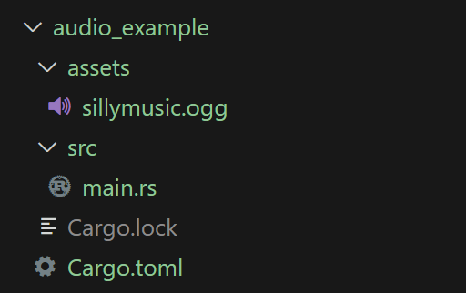

# **Interactive Audio UI in Bevy**

In this example, we explore how to load an audio file, control it using a simple button, and adjust volume with keyboard input. Here's how it all plays out.

---

## **1. Plugins**

```rust
use bevy::{
    color::palettes::basic::*, prelude::*
};
```

These are all the plugins needed for this. We import the core Bevy prelude, which brings in most of the stuff we need. The color palette lets us use some named colors for prettier UI themes.

---

## **2. Spawning the Audio**

Let’s start off by spawning a basic 2D camera, along with the audio. We also create a `MyMusic` component and attach it to the audio entity. The `MyMusic` component will help us identify the entity that’s playing the music. The audio entity contains the `AudioPlayer` and `MyMusic` components.

```rust
#[derive(Component)]
struct MyMusic;

fn setup(
    mut commands: Commands,
    asset_server: Res<AssetServer>,
) {
    commands.spawn(Camera2d); // UI camera

    commands.spawn((
        AudioPlayer::new(asset_server.load("sillymusic.ogg")), 
        MyMusic
    ));
}
```

For convenience and organization purposes, we create an `assets` folder in the package. This is where we will keep our audio files.

<div style="text-align: center;">
  
</div>

Don't forget to call the `setup()` function in the `main()` app.

```rust
fn main() {
    App::new()
        .add_plugins(DefaultPlugins)
        .add_systems(Startup, setup)
        .run();
}
```

If we run the code, we should see a blank camera view and hear the audio playing. If for some reason the audio doesn’t play, try specifying the path of your audio file.

---

## **3. Adjusting Volume**

It is often useful to adjust the volume of the audio while the program is running, so let’s create a simple function that adjusts volume based on keyboard input. We clamp the volume between **0.0 and 10.0**, adjusting it by 1 using the `+` and `-` keys.

```rust
fn volume(
    keyboard_input: Res<ButtonInput<KeyCode>>,
    music_controller: Query<&AudioSink, With<MyMusic>>,
) {
    match music_controller.get_single() {
        Ok(sink) => {
            if keyboard_input.just_pressed(KeyCode::Equal) {
                if sink.volume() < 10.0 {
                    sink.set_volume(sink.volume() + 1.0);
                }
            } else if keyboard_input.just_pressed(KeyCode::Minus) {
                if sink.volume() > 0.0 {
                    sink.set_volume(sink.volume() - 1.0);
                }
            }
        }
        Err(_) => {} // Do nothing if there's an error
    }

    // Print the current volume to the terminal
    match music_controller.get_single() {
        Ok(sink) => println!("Volume: {}", sink.volume()),
        Err(_) => {}
    }
}
```

Our function checks for keyboard input and increases or decreases the volume by `1.0` accordingly. It also checks the current volume using `sink.volume()` before adjusting, so it never exceeds the limits. After handling input, we print the current volume to the terminal.

In the `volume()` function, `sink` is a reference to `AudioSink`, which is the object that gives you control over an audio stream in Bevy. We're pulling out the `AudioSink` component from the entity that was tagged with `MyMusic`. Once we have that `sink`, we can:

- Query the current volume: `sink.volume()`
- Change the volume: `sink.set_volume(...)`
- Pause or resume playback: `sink.toggle()`

`sink` gives us access to the playback state and volume, and we only get access to it because the entity holding it was marked with our `MyMusic` component earlier in the `setup()` function.

---

## **4. UI Pause Button**

Now let's add a bit of UI into our example. We will create an interactive UI button that will pause or unpause the audio when toggled.

### **Spawn Button in `setup()`**

Let’s start off by spawning the button in the `setup()` function. We also create three constants, which are just colors we will use for the button.

```rust
const NORMAL_BUTTON: Color = Color::srgb(0.96, 0.94, 0.90); // Milky white color
const HOVERED_BUTTON: Color = Color::srgb(0.96, 0.96, 0.86); // Beige color
const PRESSED_BUTTON: Color = Color::srgb(0.85, 0.80, 0.65); // Darker beige color

fn setup(...) {
    commands.spawn(Camera2d); // UI camera
    commands.spawn((AudioPlayer::new(asset_server.load("sillymusic.ogg")), MyMusic));

    commands
        .spawn(Node {
            width: Val::Percent(100.0),
            height: Val::Percent(100.0),
            align_items: AlignItems::Center,
            justify_content: JustifyContent::Center,
            ..default()
        })
        .with_children(|parent| {
            parent
                .spawn((
                    Button,
                    Node {
                        width: Val::Px(150.0),
                        height: Val::Px(65.0),
                        border: UiRect::all(Val::Px(5.0)),
                        justify_content: JustifyContent::Center,
                        align_items: AlignItems::Center,
                        ..default()
                    },
                    BorderColor(Color::BLACK),
                    BorderRadius::MAX,
                    BackgroundColor(NORMAL_BUTTON),
                ));
        });
}
```

There is a lot of code, so let’s break it down:

```rust
commands
    .spawn(Node { ... })
```

This creates a **full-screen container** — kind of like a background panel that covers the whole window. We use this to control the layout and positioning.

- `width: Val::Percent(100.0)` and `height: Val::Percent(100.0)` stretch the container across the entire window.
- `align_items: AlignItems::Center` and `justify_content: JustifyContent::Center` make sure anything inside (like our button) will be centered vertically and horizontally.

Then:

```rust
.with_children(|parent| {
    parent.spawn((
        Button,
        Node {...},
        BorderColor(Color::BLACK),
        BorderRadius::MAX,
        BackgroundColor(NORMAL_BUTTON),
    ));
});
```

This is where the **actual button** gets created:

- `Button` tells Bevy that this UI element is interactive.
- `Node { width, height, border, ... }` sets the **size and layout of the button**.
- `BorderColor(...)` gives the border its color.
- `BorderRadius::MAX` makes the button perfectly round on the edges.
- `BackgroundColor(...)` sets the initial color of the button based on the constant we defined earlier.

So in simple terms, we just built a screen-wide UI box, put a button right in the center of it, and gave the button styling so it’s clickable and visually clean.

If we run the code, we should see a beige-colored button in the middle of the screen while the audio is playing. If we click on the button, nothing will happen — and that’s exactly what we’ll work on next.

### **Clickable Button**

Now let’s write the logic for our button. We will create a new function called `button_system()` that will check for interaction and pause the audio when the button is pressed.

```rust
fn button_system(
    mut interaction_query: Query<
        (
            &Interaction,
            &mut BackgroundColor,
            &mut BorderColor,
        ),
        (Changed<Interaction>, With<Button>),
    >,
    music_controller: Query<&AudioSink, With<MyMusic>>, // for audio control
) {
    for (interaction, mut color, mut border_color) in &mut interaction_query {
        match *interaction {
            Interaction::Pressed => {
                *color = PRESSED_BUTTON.into();
                border_color.0 = RED.into();
                pause(&music_controller); // pause the music
            }
            Interaction::Hovered => {
                *color = HOVERED_BUTTON.into();
                border_color.0 = Color::WHITE;
            }
            Interaction::None => {
                *color = NORMAL_BUTTON.into();
                border_color.0 = Color::BLACK;
            }
        }
    }
}
```

The `button_system()` function checks for any buttons whose interaction state has changed — whether the mouse just hovered over them, clicked them, or left them alone. It uses a query to find all buttons with changed interactions and then loops through each one.

When the interaction is `Pressed`, the function sets the button’s background color to the darker pressed tone, changes the border to red to signal it’s being clicked, and then calls the `pause()` function, which toggles the music on or off.

If the user is simply hovering over the button, the background switches to a lighter color and the border becomes white.
If the button isn’t being interacted with at all, it returns to its default color and black border.

```rust
fn pause(
    music_controller: &Query<&AudioSink, With<MyMusic>>,
) {
    if let Ok(sink) = music_controller.get_single() {
        sink.toggle();
    }
}
```

For convenience and organization purposes, `pause()` is defined as a separate function. All it does is toggle `sink`, which pauses or unpauses the audio.

Also don’t forget to call `button_system()` in the main app before running the code. Make sure it runs on `Update`, as we are constantly checking for button interactions.

```rust
.add_systems(Update, button_system)
```

Let’s run the code and see if it works. We should see the button change color depending on the interaction. The audio should also pause and unpause accordingly.

---

**This was just a simple example, demonstrating how to use Bevy to load audio, build interactive UI, and control playback with input.** You can check out the finished code on [audio_example](https://github.com/annazeit/bevy_blog_code/blob/main/audio_example/src/main.rs).