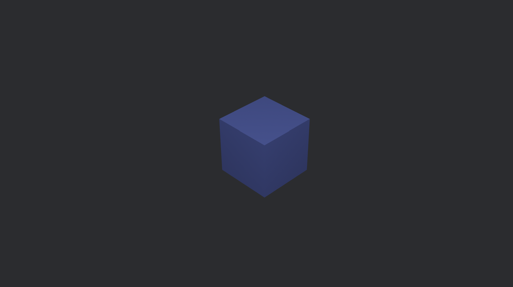
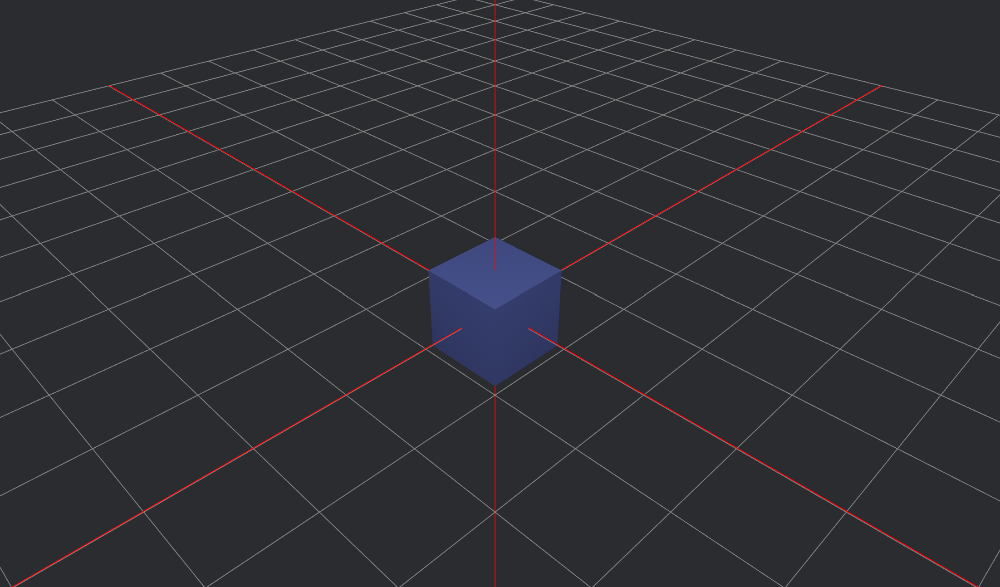

# 3D Camera and Objects

Throughout my past examples, I've only used the **2D camera**, so now let's explore Bevy's **3D world**.

## Spawning a 3D Camera

Let's start by **creating a new project with a 3D camera**.

``` rust
use bevy::prelude::*;

fn main() {
    App::new()
        .add_plugins(DefaultPlugins)
        .add_systems(Startup, setup)
        .run();
}

fn setup(
    mut commands: Commands,
) {
    // camera
        commands.spawn((
        Camera3d::default(),
        Transform::from_xyz(5.0, 5.0, 5.0).looking_at(Vec3::ZERO, Vec3::Y),
    ));
}
```

We spawn the camera as always, except this time it's `Camera3d`. Then, we set its position somewhere toward the top corner and decide what it will be facing.

Another cool thing I found is the `looking_at()` function. It essentially **tells the camera where to look**, taking in two arguments. The first argument is a **vector representing the target position** — this is where the camera will face. The second argument is the **up direction**, which helps define the correct rotation of the camera. If we use `Vec3::Y`, the camera stays **upright**. If it's `Vec3::X`, the camera **tilts sideways**, and if it's `Vec3::Z`, it **flips**. Note that the `.looking_at()` function can be used for any object, not just the camera.

So essentially, we're ensuring that the camera faces the **origin** while maintaining an **upright position**.

## Adding and Object

Now, let's add an object. For example **a cube**. We need to spawn the cube in the `setup()` function along with the camera.

``` rust
fn setup(
    mut commands: Commands,
    mut meshes: ResMut<Assets<Mesh>>,
    mut materials: ResMut<Assets<StandardMaterial>>,
) {
    // camera
        commands.spawn((
        Camera3d::default(),
        Transform::from_xyz(5.0, 5.0, 5.0).looking_at(Vec3::ZERO, Vec3::Y),
    ));

    // cube
    commands.spawn((
        Name::new("Cube"),
        Mesh3d(meshes.add(Cuboid::new(1.0, 1.0, 1.0))),
        MeshMaterial3d(materials.add(Color::srgb_u8(124, 144, 255))),
        Transform::from_xyz(0.0, 0.0, 0.0) ));
}
```

Here, we spawn a simple cuboid, set its color and assign its position. 

In all my previous **2D examples**, I always used **gizmos** to draw objects. I created **empty entities** and then visualized their bodies using gizmos. But that approach **doesn't work in 3D**, so we need to **actually spawn our objects as entities**. Unlike in 2D, where gizmos act as simple debug visuals, Bevy 3D requires actual entities to represent objects in the world. This means each object gets assigned components like a mesh, material, and transform, which define its shape, appearance, and position. 

With that said, **gizmos still exist** in Bevy 3D, and we'll be using them later in this example.

## Lighting up the Scene

Notice that if you run our code, the scene will look something like this:

<p align ="center">
    
</p>

Which isn't the best view of the cube and makes it look completely flat. Let's add some lighting to fix this problem.

``` rust
    // light
    commands.spawn((
        PointLight {
            shadows_enabled: true,
            ..default()
        },
        Transform::from_xyz(4.0, 8.0, 4.0) ));
```
The light is also an entity, so we spawn it in te `setup()` function and position it somewhere beside the camera.

<p align ="center">
    
</p>

Now the scene is well lit and the cube looks much better.

## Visualizing the Axis 

Since our scene is 3D and the camera is positioned at an angle, it can be difficult to visualize the axes. To make orientation easier, let's draw a simple grid plane using gizmos, which will act as the floor of our scene.
Let's also add extra lines to clearly indicate where the X, Y, and Z axes are, helping us better understand the scene's layout.

We will create a new function named `grid()`, which will draw the grid using gizmos.

``` rust 
fn grid(mut gizmos: Gizmos) {
    let grid_size = 10;
    let cell_size = 1.0;

    for i in -grid_size..=grid_size {
        let pos = i as f32 * cell_size;

        // Vertical grid lines
        gizmos.line(Vec3::new(pos, 0.0, -grid_size as f32), Vec3::new(pos, 0.0, grid_size as f32), GREY);

        // Horizontal grid lines
        gizmos.line(Vec3::new(-grid_size as f32, 0.0, pos), Vec3::new(grid_size as f32, 0.0, pos), GREY);
    }

    // Axis lines
    gizmos.line(Vec3::new(0.0, -10.0, 0.0), Vec3::new(0.0, 10.0, 0.0), RED); // Y-axis
    gizmos.line(Vec3::new(-10.0, 0.0, 0.0), Vec3::new(10.0, 0.0, 0.0), RED); // X-axis
    gizmos.line(Vec3::new(0.0, 0.0, -10.0), Vec3::new(0.0, 0.0, 10.0), RED); // Z-axis
}
```

Now we need to call the `grid()` function in `main()`. Make sure to run it in `Update`, so it executes every frame.

``` rust 
.add_systems(Update, grid) 
```
Lets run our code and see what it looks like.

<p align ="center">
    
</p>

Much better

## Enabling and Disabling the Grid  

It would be useful if we could **enable and disable** the grid to get a **better view of our object**. To do this, we'll **spawn the grid as an entity** with a component and write a **simple `if` statement** that checks if a key is pressed.  

We'll create a struct called **`Grid`**, which will contain a **boolean field** named **`enabled`**, which can be **toggled when a key is pressed** (let’s use the space key). It will also include other fields like **grid size** and **cell size**.  

```rust
#[derive(Component)]
pub struct Grid {
    enabled: bool,
    size: i32,
    cell_size: f32,
}
```

Then, we spawn the grid entity with a **`Grid`** component in the **`setup()`** function.  

```rust
// grid
commands.spawn(Grid {
    enabled: false,
    size: 10,
    cell_size: 1.0,
});
```

Now, we need to **modify** the `grid()` function to **check if the space key is pressed**.  

```rust
fn grid(
    mut gizmos: Gizmos,
    keyboard_input: Res<ButtonInput<KeyCode>>,
    mut grid_query: Query<&mut Grid>,
) {
    for mut grid in &mut grid_query {
        if keyboard_input.just_pressed(KeyCode::Space) {
            grid.enabled = !grid.enabled; 
        }

        if grid.enabled {
            for i in -grid.size..=grid.size {
                let pos = i as f32 * grid.cell_size;
                
                // Vertical grid lines
                gizmos.line(
                    Vec3::new(pos, 0.0, -grid.size as f32),
                    Vec3::new(pos, 0.0, grid.size as f32),
                    GREY,
                );

                // Horizontal grid lines
                gizmos.line(
                    Vec3::new(-grid.size as f32, 0.0, pos),
                    Vec3::new(grid.size as f32, 0.0, pos),
                    GREY,
                );
            }

            // Axis lines
            gizmos.line(Vec3::new(0.0, -100.0, 0.0), Vec3::new(0.0, 100.0, 0.0), RED);
            gizmos.line(Vec3::new(-100.0, 0.0, 0.0), Vec3::new(100.0, 0.0, 0.0), RED);
            gizmos.line(Vec3::new(0.0, 0.0, -100.0), Vec3::new(0.0, 0.0, 100.0), RED);
        }
    }
}
```

Since the grid is now an **entity**, we need to **query it and access its `Grid` component** before toggling its visibility.  

I wrote **`grid.enabled = !grid.enabled;`** instead of **`grid.enabled == true;`**, because if I had used `true`, there wouldn't be a way to **turn the grid off**. With this approach, we can **toggle** the grid **on and off dynamically**.  

Now, you can **run the code** and try to **press the space key** to see if it works.  

---

## Object Movement 

Let's give our **cube object** some **movement**. Suppose it's an item in a game that is **hovering above the ground** before the player picks it up. We can create this **simple hovering illusion** using the **`.sin()` function**.  

Let's create a **new function** called `hover_cube()`:  

```rust
fn hover_cube(mut transform: Single<&mut Transform, With<Mesh3d>>, time: Res<Time>) {
    let hover_speed = 3.0;
    let hover_height = 0.3;
    transform.translation.y = hover_height * (hover_speed * time.elapsed_secs()).sin();
}
```

The `hover_cube()` function makes the cube **move up and down smoothly** using a **sine wave**. The **speed** and **height** of the movement depend on the **time elapsed**, creating a **floating effect**.  

Don't forget to **call the `hover_cube()` function** in the `main()` function.  

```rust
.add_systems(Update, hover_cube)
```

Also, adjust the cube's position so it **appears to hover above the plane**, as it's **currently passing through it**. We can fix this by **setting a base height** to keep it elevated.  

```rust
fn hover_cube(mut transform: Single<&mut Transform, With<Mesh3d>>, time: Res<Time>) {
    let hover_speed = 3.0;
    let hover_height = 0.3;
    let base_height = 1.0; // Offset to keep the cube above the grid

    transform.translation.y = base_height + hover_height * (hover_speed * time.elapsed_secs()).sin();
}
```

Run the code and **take a look**—the cube should **hover up and down above the plane**.  

---

## Camera Movement

Now, let's mess around with the **camera's position** as well. We can make the camera **spin around** and **orbit the cube**.  

First, let's create an **OrbitCamera** component and add it to the **camera entity**. It will contain an **angle**, **radius**, and **speed** field.  

```rust
#[derive(Component)]
struct OrbitCamera {
    angle: f32,
    radius: f32,
    speed: f32,
}
```

Don't forget to **edit the `setup()` function** to make sure that the **`OrbitCamera` component** is also spawned with the camera entity.  

```rust
// Camera with OrbitCamera component
commands.spawn((
    Name::new("Camera"),
    Camera3d::default(),
    Transform::from_xyz(5.0, 5.0, 5.0).looking_at(Vec3::ZERO, Vec3::Y),
    OrbitCamera {
        angle: 0.0,
        radius: 5.0,
        speed: 0.5,
    },
));
```

Now, let's create an **`orbit_camera()` function** that calculates and **updates the camera's position**, while ensuring it **faces the cube**.  

```rust
fn orbit_camera(mut query: Query<(&mut Transform, &mut OrbitCamera)>, time: Res<Time>) {
    for (mut transform, mut orbit) in &mut query {
        orbit.angle += orbit.speed * time.delta_secs(); // Update angle

        let x = orbit.radius * orbit.angle.cos(); 
        let z = orbit.radius * orbit.angle.sin();
        transform.translation = Vec3::new(x, 3.0, z);
        transform.look_at(Vec3::ZERO, Vec3::Y);
    }
}
```

This function makes the **camera orbit around the origin** (which is where the cube is positioned) in a **circular motion**.  

- **`angle`** → Represents the **current rotation angle** of the camera. This **increases over time**, causing the camera to move in a **circular path**.  
- **`radius`** → Defines the **distance from the center** of the orbit. A **larger radius** makes the camera move in a **wider circle**, while a **smaller radius** keeps it **closer**.  
- **`speed`** → Controls **how fast the angle changes**, affecting the **speed of the orbiting motion**. Higher values make the camera spin **faster**.  

As `angle` updates each frame, **cosine (`cos`) and sine (`sin`) functions** calculate the **new X and Z positions**, ensuring **smooth movement**. The camera then **looks at the center (`Vec3::ZERO`)** to keep the **target in focus**. 

Finally, **run the code** and see the results—the camera should be **spinning around the cube**, ensuring it's visible from **all sides**.  

You can also check out the **finished code** on my GitHub: [spinny_cube](https://github.com/annazeit/bevy_blog_code/tree/main/spinny_cube)  

This is a very primitive example, but it gives an insight into Bevy's 3D camera and objects. I will try to include more articles exploring the Bevy 3D world and 3D gameplay in general :)
