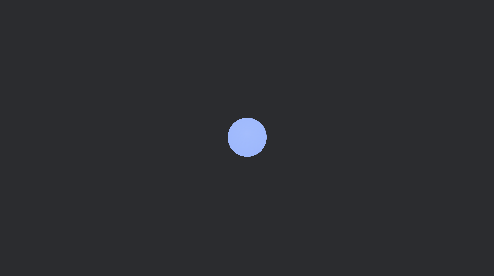
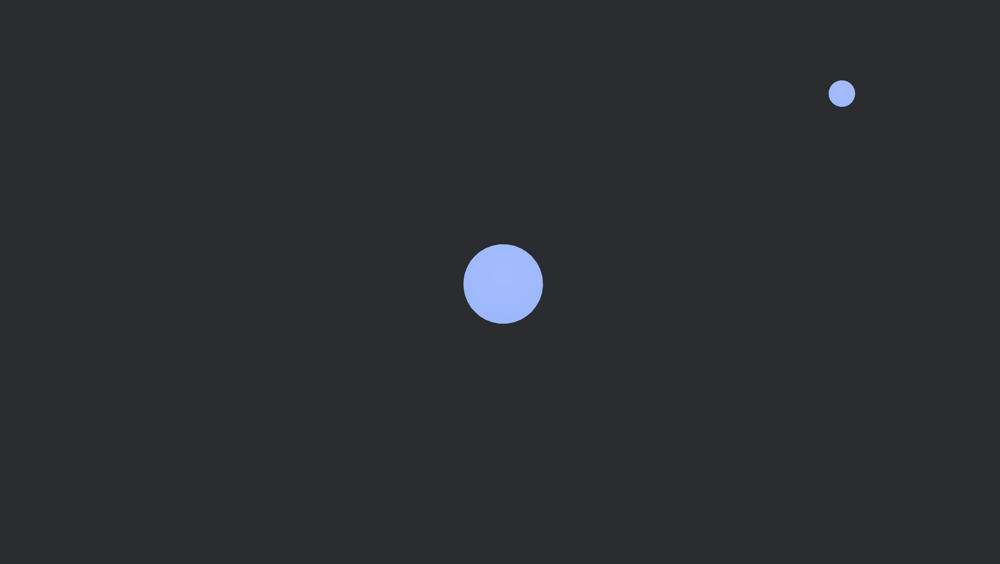
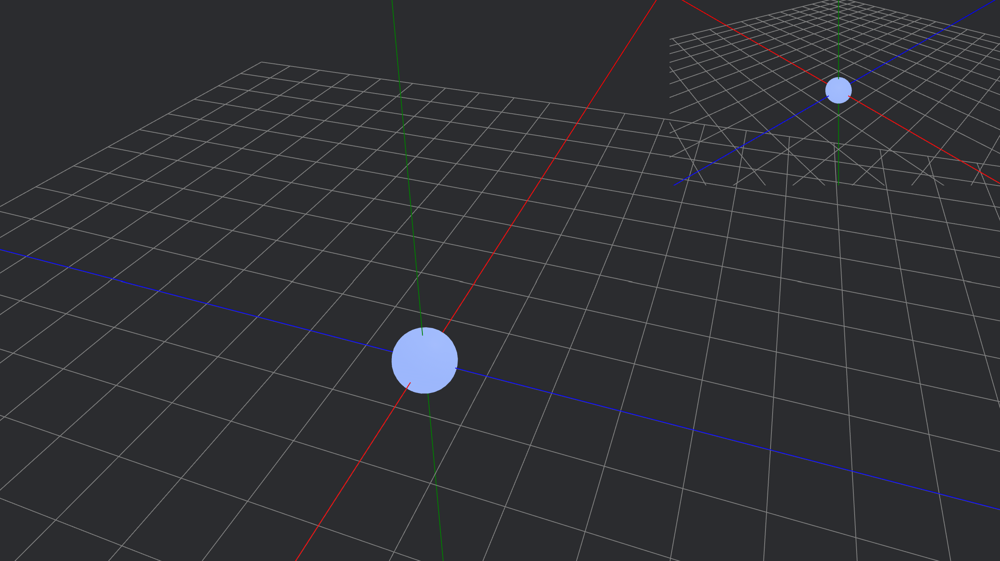
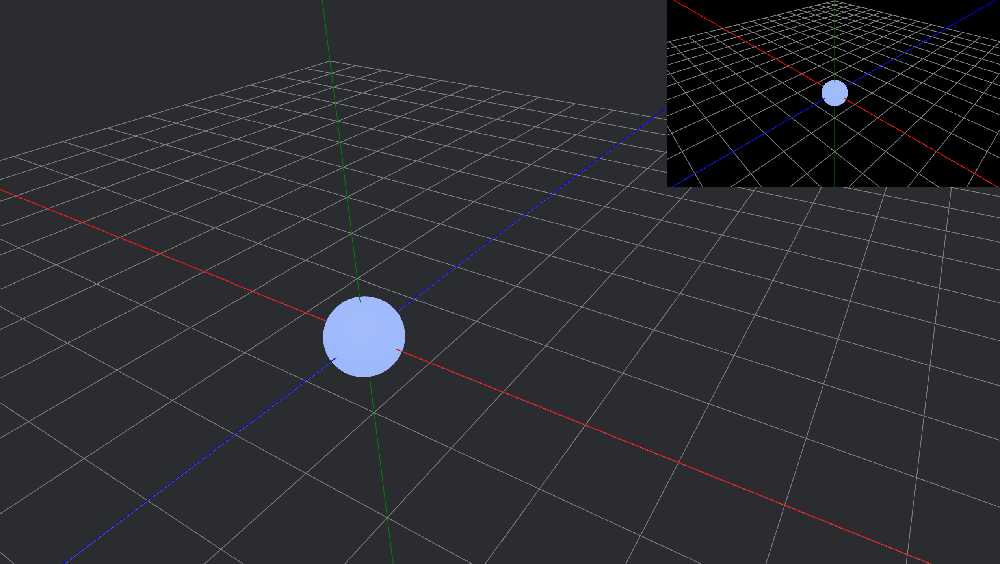
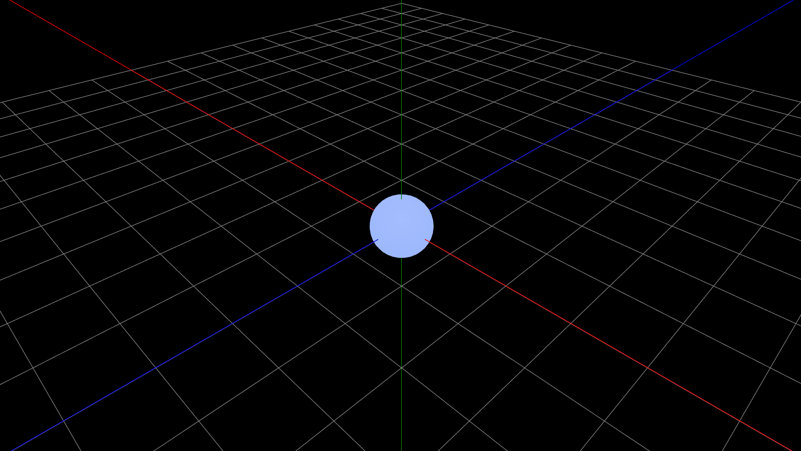

# Split-screen

Bevy doesn’t have a built-in game editor, which makes inspecting scenes from different angles while maintaining a separate game view (a fixed camera representing the player’s perspective) more challenging.

Since this concept is so useful, I decided to create a simple split-screen game editor, allowing developers to freely move one camera to inspect the world while the second camera displays the player’s in-game view. This setup is also useful for split-screen multiplayer and dynamic cinematic effects, enhancing both development and gameplay.

To improve usability, I added an axis display with a toggle to turn it on and off, along with a full-screen mode that can be activated with a key press for a better view of the game.

Here is how I did it:

---

For reference, these are all the imports we will need:

```rust
use bevy::{
    prelude::*,
    color::palettes::css::*, 
    math::UVec2,
    render::camera::Viewport, 
    window::{PrimaryWindow, Window}
};
```

---

## Spawning Two Cameras

I started off by creating an empty project and spawning two 3D cameras.

```rust
use bevy::prelude::*;

fn main() {
    App::new()
        .add_plugins(DefaultPlugins)
        .add_systems(Startup, setup)
        .run();
}

fn setup(
    mut commands: Commands,
    mut meshes: ResMut<Assets<Mesh>>,
    mut materials: ResMut<Assets<StandardMaterial>>
) {
    // game view camera
    commands.spawn((
        Name::new("game view camera"),
        Camera3d::default(),
        Transform::from_xyz(5.0, 5.0, 5.0).looking_at(Vec3::ZERO, Vec3::Y),
    ));

    // main camera
    commands.spawn((
        Name::new("MainCamera"),
        Camera3d::default(),
        Transform::from_xyz(5.0, 5.0, 5.0).looking_at(Vec3::ZERO, Vec3::Y),
    ));

}
```

Let's also spawn some objects (for example, a sphere) and a light source to light up the scene. This will make it easier for us to navigate and orient ourselves within the environment.

```rust
// light source
    commands.spawn((
        PointLight {
            shadows_enabled: true,
            ..default()
        },
        Transform::from_xyz(4.0, 8.0, 4.0),
    ));

    // core 
    commands.spawn((
        Name::new("Core"),
        Mesh3d(meshes.add(Sphere::new(0.5))),
        MeshMaterial3d(materials.add(StandardMaterial {
            base_color: Color::srgb_u8(124, 144, 255),
            emissive: Color::srgb(0.7, 0.8, 2.0).into(),
            ..default()
        })),
        Transform::from_xyz(0.0, 0.0, 0.0),
    ));
```

I find it useful to give entities names, because then it is possible to query the entity by its name. I added an **emissive color** as well so that the object appears to "glow," as if it is emitting its own light. **Emissive color does not actually light up other objects; it only affects the appearance of the object itself.**

If you run the code, you will see a light blue sphere in the middle of the scene.

<p align="center">
    
</p>

---

## Separating the Cameras

We spawned two cameras, but they are both located at the same position and are the same size, so they overlap and we only see one image.

To properly separate the cameras, we need to adjust the position and size of the game view camera, making it slightly smaller and moving it to the top right corner of the screen.

We can do this by creating a new function that will update each of the cameras' positions and sizes according to the size of the screen. **This function needs to be run on update, since it should constantly update the size of both cameras according to the size of the screen.** If we just specified the size of the cameras manually (and not in proportion to the size of the screen), the view might look bad because the cameras will stay the same size, even after we enter full-screen mode. Hopefully, this makes sense.

```rust
// Set up camera viewports and UI node size/position
fn setup_viewports(
    mut cameras: Query<(&Name, &mut Camera)>,
    windows: Query<&Window, With<PrimaryWindow>>,
) {
    let window = windows.single();
    let width = window.resolution.physical_width();
    let height = window.resolution.physical_height();

    // Size of the small camera (e.g., 1/3 of window width and height)
    let small_width = width / 3;
    let small_height = height / 3;

    for (name, mut camera) in &mut cameras {
        match name.as_str() {
            "MainCamera" => {
                // Main camera covers the whole window
                camera.viewport = Some(Viewport {
                    physical_position: UVec2::new(0, 0),
                    physical_size: UVec2::new(width, height),
                    ..default()
                });
            }
            "game view camera" => {
                camera.viewport = Some(Viewport {
                    physical_position: UVec2::new(width - small_width, 0),
                    physical_size: UVec2::new(small_width, small_height),
                    ..default()
                });
            }
            _ => {}
        }
    }
}
```

The `setup_viewports()` function assigns viewports to cameras based on their names. The **"MainCamera"** gets the full window, while the **"game view camera"** is placed as a smaller overlay in the top-right corner. The size of the game view camera is calculated as one-third of the window's width and height. So, the game view camera's viewport is always **1/3 the size of the window, positioned in the top-right**.

`windows` is a query that retrieves the primary window entity from Bevy. It allows access to the window's properties, such as its physical width and height, which are used to calculate the viewport sizes for the cameras.

The **pattern matching** checks the name of the camera and assigns it its size and position according to the size of the window.

Don't forget to call the `setup_viewports()` function in the `main()` function so it runs on **Update**.

```rust 
.add_systems(Update, setup_viewports)
```

Now if we run our code, we can see the two cameras' views.

<p align="center">
    
</p>

---

## Adding a Grid

To make the scene easier to navigate, we'll spawn a grid plane and indicate the axes, since the default background is just gray, making it difficult to see object positioning.

We’ll do this by first creating a `Grid` component that contains fields for the size and cell size of the grid.

```rust
#[derive(Component)]
pub struct Grid {
    size: i32,
    cell_size: f32,
}
```

And attach the component to the grid entity that should be spawned in the `setup()` function.

```rust
// grid entity
    commands.spawn(Grid {
        size: 10,
        cell_size: 1.0
    });
```

Then we can make a `grid()` function that will actually visualize our grid using gizmos.

```rust
// Draw grid and axes
fn grid(
    mut gizmos: Gizmos,
    grid: Single<&mut Grid>,
) {
    for i in -grid.size..=grid.size {
        let pos = i as f32 * grid.cell_size;
        gizmos.line(
            Vec3::new(pos, 0.0, -grid.size as f32),
            Vec3::new(pos, 0.0, grid.size as f32),
            GREY,
        );
        gizmos.line(
            Vec3::new(-grid.size as f32, 0.0, pos),
            Vec3::new(grid.size as f32, 0.0, pos),
            GREY,
        );
    }
    // axes
    gizmos.line(Vec3::new(-100.0, 0.01, 0.0), Vec3::new(100.0, 0.0, 0.0), RED);
    gizmos.line(Vec3::new(0.0, -100.0, 0.0), Vec3::new(0.0, 100.0, 0.0), GREEN);
    gizmos.line(Vec3::new(0.0, 0.01, -100.0), Vec3::new(0.0, 0.0, 100.0), BLUE);
}
```

The `grid()` function draws the **axes** and a **grid** on the **XZ plane**, using lines spaced by `cell_size`. It extends from **-size to +size** along both the **X and Z directions**.

If you run the code, you'll see the **grid displayed in the scene**, making it much **easier to navigate** with the **movable MainCamera**.

<p align="center">
    
</p>

---

## Grid Toggle

Again, for convenience purposes, we want to be able to turn the grid on and off.

We first need to add a new field to the `Grid` component called `enabled`. The `grid()` function will check for keyboard input and enable or disable the grid accordingly.

```rust
#[derive(Component)]
pub struct Grid {
    enabled: bool, // <-- Add this field
    size: i32,
    cell_size: f32, 
}
```

Then we also define it in the `setup()` function as well where the grid entity is spawned.

```rust
// grid entity
commands.spawn(Grid {
    enabled: false, // <-- Add this field
    size: 10,
    cell_size: 1.0 
});
```

Now we need to alter the `grid()` function using an **if** statement that checks for keyboard input. If the Space key is pressed, then enable the grid. If the grid is enabled, draw the gizmos.

```rust
// Draw grid and axes, toggle with Space
fn grid(
    mut gizmos: Gizmos,
    keyboard_input: Res<ButtonInput<KeyCode>>,
    mut grid: Single<&mut Grid>,
) {
    // toggle grid visibility
    if keyboard_input.just_pressed(KeyCode::Space) {
        grid.enabled = !grid.enabled;
    }

    if grid.enabled { // <-- Check if grid is enabled
        // grid lines
        for i in -grid.size..=grid.size {
            let pos = i as f32 * grid.cell_size;
            gizmos.line(
                Vec3::new(pos, 0.0, -grid.size as f32),
                Vec3::new(pos, 0.0, grid.size as f32),
                GREY,
            );
            gizmos.line(
                Vec3::new(-grid.size as f32, 0.0, pos),
                Vec3::new(grid.size as f32, 0.0, pos),
                GREY,
            );
        }
        // axes
        gizmos.line(Vec3::new(-100.0, 0.01, 0.0), Vec3::new(100.0, 0.0, 0.0), RED);
        gizmos.line(Vec3::new(0.0, -100.0, 0.0), Vec3::new(0.0, 100.0, 0.0), GREEN);
        gizmos.line(Vec3::new(0.0, 0.01, -100.0), Vec3::new(0.0, 0.0, 100.0), BLUE);
        }
}
```

Run the code and check if it works. Ideally, you should be able to toggle the grid on and off using the Space key.

---

## Preventing Camera Overlap

By now you have probably noticed that when you run the code, the cameras overlap and create an unpleasant effect. That is due to the game view camera being spawned on top of the MainCamera, instead of it being the usual split-screen where the screen is divided into equal parts.

While there isn't an actual way to fix this in **Bevy**, we can spawn a UI node behind the game view camera to act as a background for the scene. This is actually easier to do than you think.

Start off by spawning the UI rectangle node before the game view camera in the `setup()` function. We set its position to be in the top right corner.

```rust
    // UI node for camera background
    commands
        .spawn(Node {
            position_type: PositionType::Absolute,
            right: Val::Px(0.0),
            top: Val::Px(0.0),
            align_items: AlignItems::Center,
            justify_content: JustifyContent::Center,
            ..default()
        })
        .insert(BackgroundColor(BLACK.into()));

    // game view camera
    // MainCamera
```

And then update the size of the node along with the game view camera in the `setup()` function.

```rust
fn setup_viewports(
    mut cameras: Query<(&Name, &mut Camera)>,
    mut ui_node: Single<&mut Node>, // <-- query UI Node
    windows: Query<&Window, With<PrimaryWindow>>,
) {
    let window = windows.single();
    let width = window.resolution.physical_width();
    let height = window.resolution.physical_height();

    let small_width = width / 3;
    let small_height = height / 3;

    for (name, mut camera) in &mut cameras {
        match name.as_str() {
            "MainCamera" => {
                camera.viewport = Some(Viewport {
                    physical_position: UVec2::new(0, 0),
                    physical_size: UVec2::new(width, height),
                    ..default()
                });
            }
            "game view camera" => {
                camera.viewport = Some(Viewport {
                    physical_position: UVec2::new(width - small_width, 0),
                    physical_size: UVec2::new(small_width, small_height),
                    ..default()
                });
                // update UI Node size
                ui_node.width = Val::Px(small_width as f32) / 2.0;
                ui_node.height = Val::Px(small_height as f32) / 2.0;
            }
            _ => {}
        }
    }
}
```

Run the code and it should look something like this. The UI Node acts as a background for the game view camera and prevents overlap.

<p align="center">
    
</p>

---

## Enabling Full-Screen Mode

Let's also include a toggleable full-screen mode, so the user can see the game view more clearly.

We can do this by creating a new `FullScreen` component and attaching it to the game view camera entity in the `setup()` function. Just like the `Grid` component, `FullScreen` will contain a field named `enabled`, which can be toggled on and off using keyboard input.

```rust
#[derive(Component)]
struct FullScreen {
    enabled: bool,
}
```

```rust
// game view camera
    commands.spawn((
        Name::new("game view camera"),
        Camera3d::default(),
        Transform::from_xyz(5.0, 5.0, 5.0).looking_at(Vec3::ZERO, Vec3::Y),
        FullScreen { enabled: false }, // <-- Add this field
    ));
```

Since the `setup_viewpoints()` function is getting too crowded, we will create a separate function called `full_screen_toggle()` that checks for keyboard input and enables full-screen mode. We will then call the `full_screen_toggle()` function in the `setup_viewpoints()` function.

```rust
// Toggle full-screen for the game view camera with F11
fn full_screen_toggle(
    mut full_screen: Single<&mut FullScreen>,
    keyboard_input: Res<ButtonInput<KeyCode>>,
) {
    if keyboard_input.just_pressed(KeyCode::F11) {
        full_screen.enabled = !full_screen.enabled;
    }
}
```

Now we need to alter the `setup_viewpoints()` function to also check if full-screen mode is enabled, and update the size of the game view camera and UI Node accordingly.

```rust
// Set up camera viewpoints and UI node size/position
fn setup_viewpoints(
    mut cameras: Query<(&Name, &mut Camera)>,
    mut ui_node: Single<&mut Node>,
    windows: Query<&Window, With<PrimaryWindow>>,
    full_screen: Single<&mut FullScreen>,
    keyboard_input: Res<ButtonInput<KeyCode>>,
) {
    let window = windows.single();
    let width = window.resolution.physical_width();
    let height = window.resolution.physical_height();

    // Size of the small camera (e.g., 1/3 of window width and height)
    let small_width = width / 3;
    let small_height = height / 3;

    for (name, mut camera) in &mut cameras {
        match name.as_str() {
            "MainCamera" => {
                // MainCamera covers the whole window
                camera.viewport = Some(Viewport {
                    physical_position: UVec2::new(0, 0),
                    physical_size: UVec2::new(width, height),
                    ..default()
                });
            }
            "game view camera" => {
                match full_screen.enabled {
                    true => {
                        camera.viewport = Some(Viewport {
                            physical_size: UVec2::new(width, height),
                            ..default()
                        });
                        ui_node.width = Val::Px(width as f32) / 2.0;
                        ui_node.height = Val::Px(height as f32) / 2.0;
                    }
                    false => {
                        camera.viewport = Some(Viewport {
                            physical_position: UVec2::new(width - small_width, 0),
                            physical_size: UVec2::new(small_width, small_height),
                            ..default()
                        });
                        ui_node.width = Val::Px(small_width as f32) / 2.0;
                        ui_node.height = Val::Px(small_height as f32) / 2.0;
                    }
                }
            }
            _ => {}
        }
    }
    full_screen_toggle(full_screen, keyboard_input);
}
```

Then we add another **pattern matching** for the game view camera to check if `full_screen` is enabled. This allows the game view camera to dynamically switch between a small overlay and a full-screen view based on user input. When full-screen mode is enabled, the camera's viewport and the UI node are resized to cover the entire window, providing an unobstructed view of the game. When full-screen is disabled, the camera returns to its smaller overlay position in the top-right corner, allowing you to see both camera perspectives at once.

Run your code and see if it works. Try pressing F11 to enable full-screen mode.  
Full-screen mode will look like this:

<p align="center">
    
</p>

You can check out the finished code here: [split_screen.rs](https://github.com/annazeit/bevy_blog_code/blob/main/split_screen/src/main.rs)

---

## Adding Some Dynamic Objects

I also added some more dynamic objects to make the scene more visually interesting, such as this animated atom-like model. This isn't strictly necessary for the split-screen functionality, but it adds a fun and engaging element to the demo. The atom model features a core and an electron that orbits around it, creating a centerpiece for your scene and making the split-screen editor more enjoyable to experiment with.

Feel free to look at my [split_screen.rs](https://github.com/annazeit/bevy_blog_code/blob/main/split_screen/src/main.rs) code sample and include the code in your project.

I encourage you to check out my [split_screen.rs](https://github.com/annazeit/bevy_blog_code/blob/main/split_screen/src/main.rs) code sample and try including it in your own project. It demonstrates the split-screen setup and also shows how to add interactive and animated elements to make your editor or demo scene more lively and fun to use.

---

Here is a short explanation of how it works:

### How the Electron’s Path Works

1. **Orbit Calculation:**
   - The electron moves in a circle around the origin (the core).
   - Each frame, the angle (`angle.0`) is increased by `speed * time.delta_secs()`.
   - The electron’s position is calculated as:
     ```rust
     let x = radius * angle.0.cos();
     let z = radius * angle.0.sin();
     let mut pos = Vec3::new(x, 0.0, z);
     ```
     This means the electron moves in a circle of radius `2.0` in the XZ plane.

2. **Orbit Angle Update:**
   - `angle.0` is the current angle (in radians) of the electron on its orbit.
   - `speed` controls how fast the electron moves around the core.
   - `time.delta_secs()` is the time since the last frame, making the movement frame-rate independent.
   - Each frame, `angle.0` increases, so the electron moves around the circle.

3. **Tilt (Orbit Plane Rotation):**
   - The orbit plane is rotated by a tilt angle (`tilt.0`), which oscillates over time. In this example, the tilt is applied around the Z axis, but you can experiment with other axes for different effects.
   - This is done by:
     ```rust
     let tilt_quat = Quat::from_axis_angle(Vec3::Z, tilt.0);
     pos = tilt_quat * pos;
     ```
   - As `tilt.0` changes, the orbit tilts back and forth, creating a "flower-like" 3D path.

4. **Oscillating the Tilt:**
   - `tilt.0` changes smoothly over time, oscillating between `-tilt_amplitude` and `+tilt_amplitude`.
   - This means the orbit is not always in the same plane: it rocks back and forth, causing the electron’s path to "wobble" and create a flower-like pattern in 3D.
   - Example:
     ```rust
     tilt.0 = tilt_amplitude * (time.elapsed_secs() * tilt_speed).sin();
     ```

5. **Resulting Path:**
   - If the tilt were constant, the electron would move in a simple tilted circle.
   - Because the tilt oscillates, the orbit’s plane is constantly changing, so the electron’s path traces out a complex, flower-like 3D shape.

---

### How the Trace Works

1. **Storing the Path:**
   - Each frame, the electron’s current position (`pos`) is pushed to `trace.points`, which is a `Vec<Vec3>`.
   - If the number of points exceeds `trace.max_points`, the oldest point is removed:
     ```rust
     if trace.points.len() > trace.max_points {
         trace.points.remove(0);
     }
     ```
   - This keeps the trace at a fixed length, showing only the most recent part of the path.

2. **Drawing the Trace:**
   - The `electron_trace_gizmo_system()` function draws lines between consecutive points in `trace.points`.
   - Each segment is colored based on its position in the trace, creating a gradient effect.

---

### Summary

- The electron moves in a tilted, oscillating circular path around the core.
- Its positions are stored in a buffer (`trace.points`), which is visualized as a colored line (the trace).
- The trace shows the recent history of the electron’s movement, creating a dynamic, flower-like pattern as the tilt oscillates.
- The electron moves in a circle, but the plane of that circle tilts back and forth over time. This tilt is what causes the path to become a dynamic, flower-like shape instead of a simple ring.

